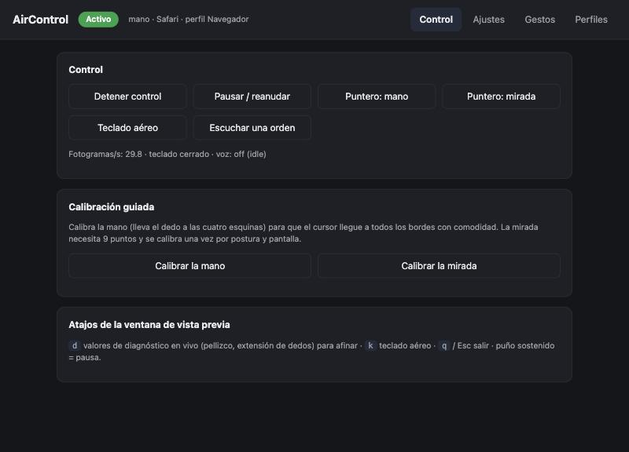

<div align="center">

# AirControl

**Control your computer with your hand, your gaze and your voice. No touching. 100% local.**

Air mouse · air keyboard · voice · custom gestures · per-app profiles

[](https://github.com/HMJ07/aircontrol/actions/workflows/build.yml)
[](https://github.com/HMJ07/aircontrol/releases/latest)
[](LICENSE)


[**⬇️ Download**](https://github.com/HMJ07/aircontrol/releases/latest) · [Español](README.md)



</div>

AirControl turns your webcam and microphone into a mouse, a keyboard and a remote control. It is built for **accessibility** (limited mobility, fatigue, busy hands) and as a free, open alternative to the paid, closed solutions available today.

**Privacy:** video and audio are processed on your machine. Nothing is sent or stored — no server, no accounts, no telemetry.

## Download & install

| System | Download | Install |
|---|---|---|
| 🍎 **macOS** (Apple Silicon, macOS 12+) | [`AirControl-macOS.dmg`](https://github.com/HMJ07/aircontrol/releases/latest/download/AirControl-macOS.dmg) | Open the `.dmg` and **drag AirControl to Applications** |
| 🪟 **Windows** 10 / 11 | [`AirControl-Setup.exe`](https://github.com/HMJ07/aircontrol/releases/latest/download/AirControl-Setup.exe) | Double-click → Next → Install (no admin rights needed) |

A portable Windows `.zip` is also on the [Releases](https://github.com/HMJ07/aircontrol/releases/latest) page.

### First launch

**macOS**
1. The app is not signed with an Apple Developer ID (that needs a paid account), so macOS warns you the first time. That is expected. With the app in *Applications*, run this **once** in Terminal:
   ```bash
   xattr -dr com.apple.quarantine /Applications/AirControl.app
   ```
   (Alternative: try to open it → *System Settings → Privacy & Security* → **Open Anyway**.)
2. Open it and grant the permissions when asked:
   - **Camera** — to track your hand and face.
   - **Accessibility** — to move the mouse and press keys. Without it macOS silently drops those events; AirControl detects that and tells you.
   - **Microphone** — only if you enable voice.
3. Each new app version asks for *Accessibility* again (the signature changes with every build).

**Windows**
- If SmartScreen warns: *More info → Run anyway*.
- A normal program cannot control windows running as administrator (a Windows limitation).

A **menu-bar icon** (macOS) or **tray icon** (Windows) appears: pause, switch between hand and gaze, air keyboard, calibrate, and **Settings…**.

## Get started in 5 minutes

1. **Settings… → Control → Calibrate hand**: point at the four screen corners so the cursor reaches every edge without stretching your arm.
2. Point with your index finger and move your hand; pinch thumb + index to click.
3. Something off? Press `d` in the preview window for live diagnostics, or see [Troubleshooting](#troubleshooting).

| Pose | Action |
|---|---|
| ☝️ index finger extended | move the cursor |
| 🤏 thumb + index | left click · two in a row = double click · hold or move = drag |
| 🤏 thumb + middle | right click |
| ✌️ index + middle extended | scroll with vertical hand movement |
| 🖐️ / ✊ | rest: the cursor is left alone |
| ✊ **held 1.2 s** | **pause / resume** all control (always available) |
| 👍 · palm swipe | per-app configurable actions (play/pause, next slide…) |

## Features

- **🖐️ Hand mouse** — move, click, double click, right click, drag and scroll, with [One-Euro](https://gery.casiez.net/1euro/) smoothing (fluid, jitter-free).
- **👁️ Gaze mouse** — cursor from iris + head pose, guided 9-point calibration reporting the mean error in pixels. Click by dwell, long blink or pinch.
- **⌨️ Air keyboard** — on-screen keyboard with word suggestions, driven by hand (pinch) or gaze (dwell).
- **🎙️ Local voice** — "open Safari", "click", "type hello…", "scroll down". [Whisper](https://github.com/SYSTRAN/faster-whisper) on your machine; common commands resolve instantly by rules (Spanish and English); [Ollama](https://ollama.com) is an optional fallback that only *proposes* an action as text, validated against the known action list.
- **✋ Custom gestures** — teach a gesture from a few samples and bind it to an action or shortcut.
- **🗂️ Per-app profiles** — the same gesture does different things in the browser, a slideshow or a video player.
- **Settings page** — sliders for every threshold, gestures, training, calibrations and a visual profile editor. No files to edit.

Actions: `key:mod+c` (`mod` = ⌘ on macOS, Ctrl on Windows) · `click` · `right_click` · `double_click` · `scroll:down:5` · `media:play_pause|next|prev|volume_up|volume_down|mute` · `open:Safari` · `open:https://…` · `text:hello` · `pause` / `resume` · `mode:hand|gaze|toggle` · `keyboard` · `voice`.

Voice model (~140 MB) downloads the first time voice is enabled (internet needed once). Ollama is optional.

## Troubleshooting

Two **real** checks that tell you what is happening and which setting to change (run from source):

```bash
python main.py check-input   # cursor, clicks, drag, keys, volume, opening apps: does the OS obey?
python main.py check-hand    # guides you through each gesture with your hand and explains failures
```

Also: `python main.py doctor`, `record` / `replay` to replay a recording of your hand with different thresholds, and `d` in the preview for live pinch distances and finger extension.

## Run from source

Python 3.10–3.12 (MediaPipe does not support 3.13+ yet).

```bash
git clone https://github.com/HMJ07/aircontrol.git && cd aircontrol
python3.11 -m venv venv && source venv/bin/activate     # Windows: venv\Scripts\activate
pip install -r requirements.txt
pip install -r requirements-voice.txt                   # optional: voice
python main.py doctor
python main.py app                                      # menu-bar icon + control + settings
```

`python main.py run --dry-run` shows what it would do without moving the mouse. `python -m unittest discover -s tests -v` runs 180+ tests (no camera or permissions needed). Installers: `bash packaging/build_mac.sh`, `./packaging/build_windows.ps1`.

## Known limitations

- **Gaze:** a webcam gives centimeter-level accuracy; dwell click has no ring next to the cursor (there is a confirmation beep and progress shows in the preview).
- **Thresholds:** defaults were tuned with synthetic data and one real hand on macOS; every hand differs — use calibration, `check-hand` and the settings.
- **Windows:** installers and real-API tests run in CI; real-hardware experience on Windows is less tested than on macOS.
- **Intel Macs:** the installer is Apple Silicon only; run from source on Intel.
- **Multiple monitors:** only the main display is controlled.

## License

[MIT](LICENSE) © 2026 Hugo Arribas Muñoz
