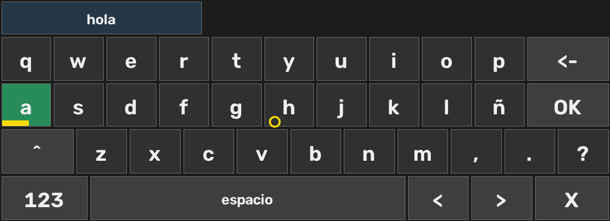
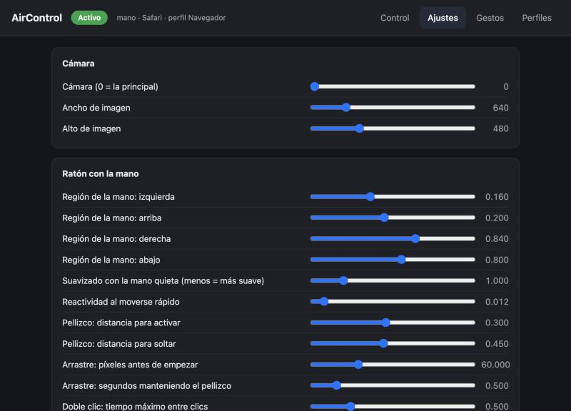
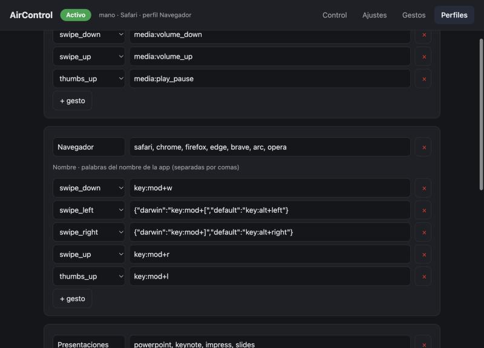

<div align="center">

# AirControl

**Controla el ordenador con la mano, la mirada y la voz. Sin tocar nada. 100 % en local.**

Ratón aéreo · teclado aéreo · voz · gestos propios · perfiles por aplicación

[](https://github.com/HMJ07/aircontrol/actions/workflows/build.yml)
[](https://github.com/HMJ07/aircontrol/releases/latest)
[](LICENSE)


[**⬇️ Descargar**](https://github.com/HMJ07/aircontrol/releases/latest) · [English](README.en.md)


</div>

AirControl convierte la webcam y el micrófono en un ratón, un teclado y un mando a distancia. Está pensado para **accesibilidad** (movilidad reducida, fatiga, manos ocupadas) y como alternativa abierta y gratuita a las soluciones de pago y cerradas que existen hoy.

**Privacidad:** el vídeo y el audio se procesan en tu equipo. No se envía ni se guarda nada (no hay servidor, ni cuentas, ni telemetría).

## Descargar e instalar

| Sistema | Descarga | Instalación |
|---|---|---|
| 🍎 **macOS** (Apple Silicon, macOS 12 o superior) | [`AirControl-macOS.dmg`](https://github.com/HMJ07/aircontrol/releases/latest/download/AirControl-macOS.dmg) | Abre el `.dmg` y **arrastra AirControl a Aplicaciones** |
| 🪟 **Windows** 10 / 11 | [`AirControl-Setup.exe`](https://github.com/HMJ07/aircontrol/releases/latest/download/AirControl-Setup.exe) | Doble clic → Siguiente → Instalar (sin permisos de administrador) |

También hay un `.zip` portátil para Windows en [Releases](https://github.com/HMJ07/aircontrol/releases/latest).

### Primer arranque

**macOS**
1. La app no está firmada con un Developer ID de Apple (requiere una cuenta de pago), así que macOS avisará la primera vez. Es normal. Con la app ya en *Aplicaciones*, ejecuta **una vez** en la Terminal:
   ```bash
   xattr -dr com.apple.quarantine /Applications/AirControl.app
   ```
   (Alternativa: intenta abrirla → *Ajustes del Sistema → Privacidad y seguridad* → **Abrir igualmente**.)
2. Ábrela y concede los permisos cuando los pida:
   - **Cámara** — para seguir la mano y la cara.
   - **Accesibilidad** — para mover el ratón y pulsar teclas. Sin este permiso macOS descarta los eventos *sin avisar*; AirControl lo detecta y te lo explica.
   - **Micrófono** — solo si activas la voz.
3. Cada versión nueva de la app vuelve a pedir *Accesibilidad* (la firma cambia con cada compilación).

**Windows**
- Si SmartScreen avisa: *Más información → Ejecutar de todas formas*.
- Un programa normal no puede controlar ventanas ejecutadas como administrador (limitación de Windows).

Al abrirla aparece un **icono en la barra de menús** (macOS) o en la **bandeja** (Windows). Desde él: pausar, cambiar entre mano y mirada, teclado aéreo, calibrar y **Ajustes…**.

## Empezar en 5 minutos

1. Abre **Ajustes… → Control → Calibrar la mano**: lleva el dedo a las cuatro esquinas para que el cursor llegue a todos los bordes sin estirar el brazo.
2. Señala con el índice y mueve la mano: el cursor te sigue. Pellizca pulgar + índice para hacer clic.
3. ¿Algo no va como esperas? Activa el diagnóstico en la ventana de vista previa (tecla `d`) o mira [Si algo no va](#si-algo-no-va).

### Poses de la mano

| Pose | Acción |
|---|---|
| ☝️ índice extendido | mueve el cursor |
| 🤏 pulgar + índice | clic izquierdo · dos seguidos = doble clic · mantener o mover = arrastrar |
| 🤏 pulgar + corazón | clic derecho |
| ✌️ índice y corazón extendidos | scroll con el movimiento vertical de la mano |
| 🖐️ / ✊ | reposo: el cursor no se toca |
| ✊ **sostenido 1,2 s** | **pausa / reanuda** todo el control (siempre disponible) |
| 👍 · deslizar la palma | acciones configurables por aplicación (p. ej. reproducir/pausar, pasar diapositiva) |

## Qué puede hacer

<table>
<tr>
<td width="50%" valign="top">

**🖐️ Ratón con la mano** — mover, clic, doble clic, clic derecho, arrastrar y scroll, con suavizado [One-Euro](https://gery.casiez.net/1euro/) para que sea fluido y sin temblor.

**👁️ Ratón con la mirada** — cursor con el iris y la cabeza, calibración guiada de 9 puntos con el error medio en píxeles. Clic por permanencia, parpadeo largo o pellizco.

**⌨️ Teclado aéreo** — teclado en pantalla con sugerencias de palabras, manejable con la mano (pellizco) o con la mirada (permanencia).

</td>
<td width="50%" valign="top">

**🎙️ Voz local** — "abre Safari", "haz clic", "escribe hola…", "baja". [Whisper](https://github.com/SYSTRAN/faster-whisper) en tu equipo; las órdenes comunes se resuelven al instante por reglas (español e inglés) y [Ollama](https://ollama.com) es un respaldo opcional.

**✋ Gestos propios** — enseña un gesto con unas muestras y asócialo a una acción o atajo.

**🗂️ Perfiles por aplicación** — el mismo gesto hace cosas distintas en el navegador, en una presentación o en un vídeo.

</td>
</tr>
</table>

<p align="center">

</p>

Todo se configura desde la página de ajustes, sin editar ficheros:

<p align="center">


</p>

### Voz

Actívala en **Ajustes → Voz**:
- `push`: di la orden tras activar la escucha (menú del icono → *Escuchar una orden*).
- `wake`: siempre atento; solo actúa si empiezas por la palabra de activación ("**control**, abre Safari").

La primera vez se descarga el modelo de reconocimiento (~140 MB; necesita internet una sola vez). **Ollama es opcional**: solo interpreta las órdenes que las reglas no entienden, y únicamente *propone* una acción en texto que se valida contra la lista de acciones conocidas; nunca ejecuta nada por su cuenta.

### Acciones disponibles

`key:mod+c` (`mod` = ⌘ en macOS, Ctrl en Windows) · `click` · `right_click` · `double_click` · `scroll:down:5` · `media:play_pause|next|prev|volume_up|volume_down|mute` · `open:Safari` · `open:https://…` · `text:hola` · `pause` / `resume` · `mode:hand|gaze|toggle` · `keyboard` · `voice`.
Un valor puede ser `{ "darwin": …, "default": … }` para que el mismo perfil sirva en ambos sistemas.

## Si algo no va

Dos pruebas **reales** que te dicen qué pasa y qué ajuste cambiar (se ejecutan desde el código, ver [Ejecutar desde el código](#ejecutar-desde-el-código)):

```bash
python main.py check-input   # cursor, clics, arrastre, teclas, volumen y abrir apps: ¿obedece el sistema?
python main.py check-hand    # te guía gesto a gesto con tu mano y, si uno falla, explica por qué
```

Además: `python main.py doctor` (cámara, permisos, micrófono, calibraciones), `record` / `replay` para reproducir una grabación de tu mano con otros umbrales, y la tecla `d` en la vista previa para ver en vivo las distancias de pellizco y la extensión de cada dedo.

## Ejecutar desde el código

Requiere Python 3.10–3.12 (MediaPipe aún no soporta 3.13+).

```bash
git clone https://github.com/HMJ07/aircontrol.git && cd aircontrol
python3.11 -m venv venv && source venv/bin/activate     # en Windows: venv\Scripts\activate
pip install -r requirements.txt
pip install -r requirements-voice.txt                   # opcional: voz
python main.py doctor                                   # comprueba cámara, permisos y calibraciones
python main.py app                                      # icono en la barra de menús + control + ajustes
```

Sin bandeja: `python main.py run` (añade `--dry-run` para ver lo que haría sin mover el ratón). Todos los comandos: `python main.py --help`.

```bash
python -m unittest discover -s tests -v                 # 180+ pruebas, sin cámara ni permisos
bash packaging/build_mac.sh                             # dist/AirControl-macOS.dmg
./packaging/build_windows.ps1                           # dist\AirControl-Setup.exe (necesita Inno Setup)
```

<details>
<summary><b>Arquitectura</b></summary>

```
app (bandeja + web de ajustes)  ──órdenes/estado por ficheros──►  motor (proceso aparte)
                                                                   cámara → manos / cara → Controller
  Controller ─► AirMouse (mano) · GazePointer (mirada) · KeyboardState · gestos · Profiles ─► Action
  voz (hilo): micrófono → VAD → Whisper → reglas | Ollama → Action
  InputBackend: PynputBackend (macOS/Windows) · DryRunBackend
```

La lógica (puntero, mirada, teclado, gestos, perfiles, voz, calibraciones, motor) no depende de cámara ni del sistema operativo y se prueba con manos y caras sintéticas, audio generado y una cámara y ventana simuladas. La página de ajustes solo escucha en `127.0.0.1`, exige un token y comprueba el `Host` (contra CSRF y DNS rebinding).

El CI (`.github/workflows/build.yml`) ejecuta las pruebas (en Windows, además, las que usan la API real), construye los dos instaladores y lanza `--selftest` sobre la app empaquetada; al subir una etiqueta `v*` los publica en Releases.
</details>

## Limitaciones conocidas

- **Mirada:** una webcam da precisión de unos centímetros; el clic por permanencia no tiene un anillo junto al cursor (hay un pitido de confirmación y el progreso se ve en la vista previa).
- **Umbrales:** los valores por defecto se han afinado con datos sintéticos y con una sola mano real en macOS; cada mano es distinta, así que usa la calibración, `check-hand` y los ajustes.
- **Windows:** los instaladores y las pruebas con la API real se ejecutan en el CI; la experiencia con hardware real en Windows está menos probada que en macOS.
- **macOS Intel:** el instalador es solo para Apple Silicon; en Intel, ejecútalo desde el código.
- **Varios monitores:** se controla la pantalla principal.
- **Voz:** en modo `wake` se transcribe toda frase detectada (CPU); el modelo `tiny` es más ligero que `base`.

## Contribuir

Issues y pull requests son bienvenidos. Antes de enviar un cambio: `python -m unittest discover -s tests`.

## Licencia

[MIT](LICENSE) © 2026 Hugo Arribas Muñoz
